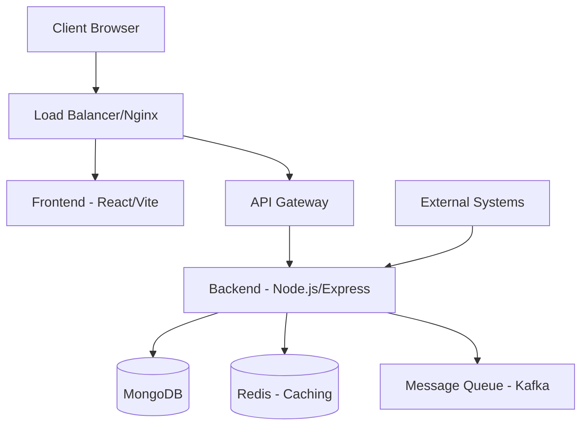
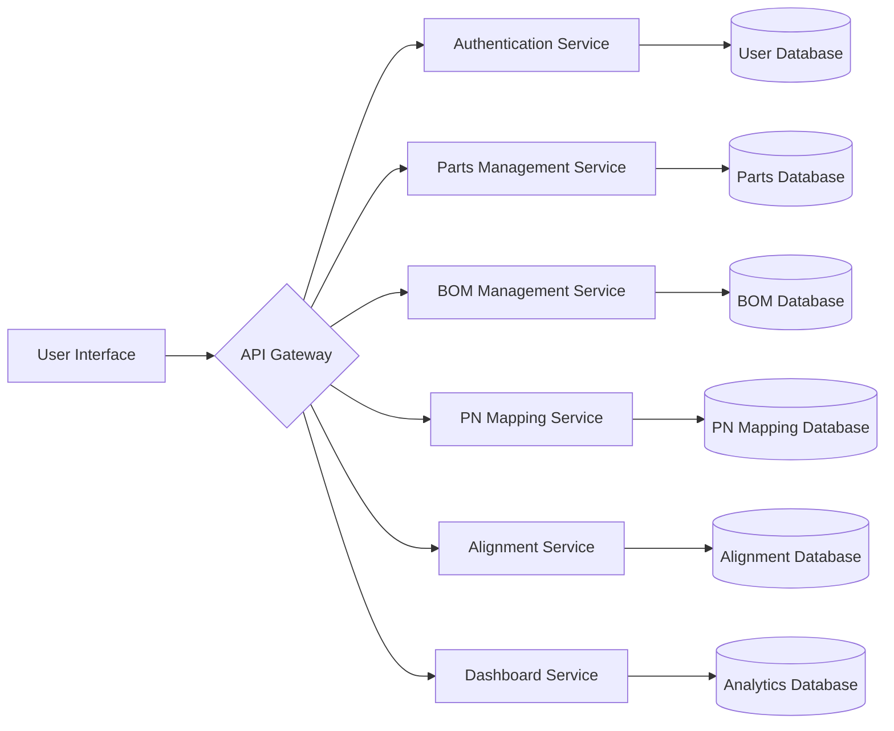

# PPM 3.0 Architecture Documentation

## System Overview

PPM 3.0 (Product Portfolio Management 3.0) is a modern web application designed for managing product portfolios in manufacturing environments. The system provides capabilities for parts management, BOM (Bill of Materials) management, PN (Part Number) mapping, and automated alignment processes.

## Architecture Diagram



## Technology Stack

### Frontend

- **Framework**: React 18 with Hooks
- **Build Tool**: Vite
- **State Management**: Redux Toolkit
- **Routing**: React Router v6
- **Styling**: Tailwind CSS
- **Data Visualization**: D3.js, Recharts
- **HTTP Client**: Axios

### Backend

- **Runtime**: Node.js
- **Framework**: Express.js
- **Database**: MongoDB with Mongoose ODM
- **Caching**: Redis
- **Authentication**: JWT
- **Validation**: Joi
- **Logging**: Winston
- **Message Queue**: Kafka (for async processing)

### Infrastructure

- **Containerization**: Docker
- **Orchestration**: Docker Compose
- **Reverse Proxy**: Nginx
- **CI/CD**: GitHub Actions
- **Monitoring**: Prometheus + Grafana (planned)

## Directory Structure

```tree
PPM3.0/
├── client/                    # Frontend application
│   ├── public/                # Static assets
│   ├── src/                   # Source code
│   │   ├── components/        # Reusable UI components
│   │   ├── pages/             # Page components
│   │   ├── services/          # API service layer
│   │   ├── utils/             # Utility functions
│   │   ├── assets/            # Images, icons, etc.
│   │   ├── hooks/             # Custom React hooks
│   │   ├── store/             # Redux store
│   │   └── App.jsx            # Main application component
│   ├── package.json           # Frontend dependencies
│   └── vite.config.js         # Vite configuration
├── server/                    # Backend API
│   ├── src/                   # Source code
│   │   ├── controllers/       # Request handlers
│   │   ├── models/            # Database models
│   │   ├── routes/            # API routes
│   │   ├── middleware/        # Custom middleware
│   │   ├── services/          # Business logic
│   │   ├── utils/             # Utility functions
│   │   ├── config/            # Configuration files
│   │   └── app.js             # Application entry point
│   ├── tests/                 # Backend tests
│   ├── package.json           # Backend dependencies
│   └── .env                   # Environment variables
├── shared/                    # Shared code between frontend and backend
│   ├── types/                 # TypeScript types (or JS constants)
│   └── constants/             # Shared constants
├── docs/                      # Documentation
│   ├── api/                   # API documentation
│   ├── architecture/          # Architecture documentation
│   └── guides/                # User and developer guides
├── scripts/                   # Automation scripts
│   ├── deploy.sh              # Deployment script
│   ├── build.sh               # Build script
│   └── seed.js                # Database seeding script
├── docker/                    # Docker configurations
│   ├── nginx/                 # Nginx configuration
│   ├── app/                   # Application Dockerfile
│   └── db/                    # Database Dockerfile
├── .github/                   # GitHub configurations
│   └── workflows/             # CI/CD workflows
├── .gitignore                 # Git ignore file
├── docker-compose.yml         # Docker Compose configuration
├── README.md                  # Project README
└── package.json               # Root package.json (workspaces)
```

## Data Flow



## Security

### Authentication

- JWT-based authentication
- Password hashing with bcrypt
- Role-based access control

### Authorization

- User roles: admin, product_manager, sales, procurement, finance
- Route-level permissions
- Data-level permissions

### Data Protection

- HTTPS encryption
- Environment variable secrets
- Input validation and sanitization
- Rate limiting

## Scalability

### Horizontal Scaling

- Stateless backend services
- Database sharding (planned)
- Load balancing with Nginx
- Caching with Redis

### Microservices (Future)

- Parts service
- BOM service
- PN mapping service
- Alignment service
- Notification service

## Deployment

### Development

- Docker Compose for local development
- Hot reloading for frontend and backend
- MongoDB and Redis containers

### Production

- Kubernetes orchestration (planned)
- CI/CD pipeline with GitHub Actions
- Automated testing and deployment
- Monitoring and alerting

## Monitoring and Logging

### Logging

- Structured logging with Winston
- Log levels: error, warn, info, debug
- Log rotation and retention

### Monitoring

- Application performance monitoring (planned)
- Database performance metrics (planned)
- API response time tracking (planned)
- Error rate tracking (planned)
